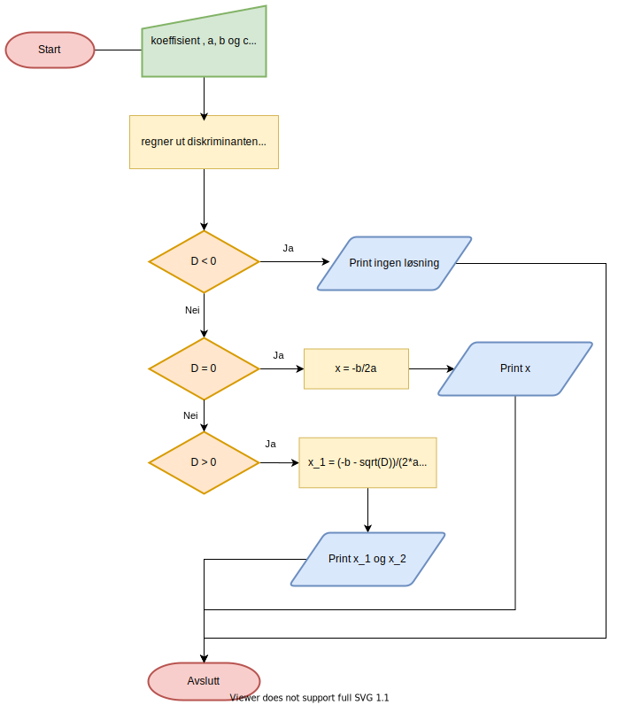
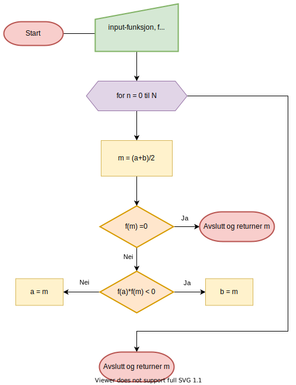

# NTNU-Miniprosjekt

Et git-repo med filer til miniprosjekt i IT6203 på NTNU

[NTNU-Miniprosjekt](https://github.com/mareis/NTNU-Miniprosjekt)

## Undervisningsopplegg i Jupyter
    
- [Andregradsformelen](undervisning/Andregradsformelen.ipynb)

- [Halveringsmetoden](undervisning/Halveringsmetoden.ipynb)

## En quiz i terminalvinduet 
- [quiz.py](quiz/quiz.py)

- [Dokumentasjon](https://ntnu-miniprosjekt.readthedocs.io/en/latest/quiz.html)

## Oppgaven

### **Alternativ 2:** Bruke programmering i undervisning

Lag et program som forklarer et valgfritt konsept i et emne du underviser i, for eksempel
sannsynlighetsregning med en terning. Programmet skal forklare konseptet, og vise utregning eller
brukerinput fra bruker for å komme frem til et resultat. Programmet skal kunne styres av brukeren ved hjelp av input.

Dere står fritt frem til å løse programmerings-delen av oppgaven slik dere ønsker, det eneste kravet er at det må skrives i Python og leveres som .py-fil. Alle punktene i malen for prosjektplan og -rapport skal besvares. Her er det ingen krav, eller begrensning, på lengde.

### 1 Tolking av oppgaven
---

Vi valgte å dele opp oppgaven i 2 deler. 

- Del 1: Undervisningsopplegg i Jupyter
- Del 2: En terminalquiz som py-fil 

For oss virket det unaturlig å lage et terminal-program som skulle "forklare" et matematiske konsept fra *Matematikk 1T*. Vi valgte derfor å overse dette og bruke jupyter til den delen. 

Siden vi skulle levere en py-fil og styre programmet med input fra bruker, kom vi frem til at vi kunne vise tilstrekkelig kompetanse ved å lage en brukerstyrt terminalquiz. Spørsmål og resultat skrives til fil og programmet skriver ut historikk og statistikk. Quizen har spørsmål fra Undervisningsopplegget i Jupyter.
 

### 2 Praktiske hensyn 
---

- **Verktøy:** 
    - Visual Studio Code med
    - Extensions:
        - Python
        - Jupyther
        - Live Share

- **Biblioteker**:
    - Undervinsdokumenter i Jupyter:
        - math
        - numpy
        - matplotlib

    - Terminalquiz:
        - random
        - os
        - math
        - json
        - time

- **Antall personer:** 2

- **Fordeling:** Tilnærmet likt fordelt med samarbeid i Visual Studio Code med Live Share Extansion. Begge jobber på samme skole og underviser *Matematikk 1T*.

- **Planlagt tid**
    - Undervisningsopplegg:
        - Analyse:  **1 timer**
        - Design: **2 timer**
        - Implementering **18 timer**
        - Testing og revidering **3 time**

    - Quiz:
        - Analyse:  **1 timer**
        - Design: **3 timer**
        - Implementering:  **21 timer**
        - Testing og revidering:  **4 timer**

### 3 Løsning
---

#### **Undervisningsopplegg**

- **Analyse**

    Se jupyter-dokument for detaljer.

- **Design**

    [Andregradsformelen](undervisning/Andregradsformelen.ipynb)
 

    
        

    [Halveringsmetoden](undervisning/Halveringsmetoden.ipynb)

    

- **Implementering**

    - [Andregradsformelen](undervisning/Andregradsformelen.ipynb)
    - [Halveringsmetoden](undervisning/Halveringsmetoden.ipynb)
        
    For å kunne formidle den eksplisitte og den numeriske metoden for å finne nullpunkt var det mest hensiktsmessig å bruke Jupyter.

    Det er en utmerket plattform for å kombinere bilder, matematisk notasjon og programmering. Alt er i tillegg redigerbart for elevene, slik at det gir rom for å utforske og eksperimentere. 

- **Testing og revidering**

    Notebookene er testet på lærere og elever på skolen, men har foreløpig ikke hatt behov for revidering.

#### **Quiz**

- **Analyse**
    
    For å tilfredsstille kravene til oppgaven og for å vise tilstrekkelig programmeringskompetanse valgte vi å lage en brukerstyrt terminal-quiz i Python. 
    
    *Quizen* leser datafilen med få oppgaver under testingen.

    -- **Kravspesifikasjon** -- 
    - Presentere en meny med følgende valg
        - Starte quiz
        - Vise statistikk/historikk
        - Avslutte program
        - Slette historikken

    - Lese fil med oppgaver, svaralternativer og svarhistorikk til liste med dictionarys

    - Hvis *Starte quiz*
        - Trekk ut oppgaver i tilfeldig rekkefølge
        - Presenter svaralternativer til brukeren og registrer svaret.
        - Når alle oppgavene er besvart: Presenter en rapport med informasjon om oppgavene som er feil besvart.
        - Gå tilbake til meny

    - Hvis *Vise statistikk/historikk*
        - Presentere en tabell over antall rette og gale svar for de ulike forsøkene til brukeren.

    
    - Hvis *Avslutte program*
        - Avslutt Python-programmet

    - Hvis *Slette historikken*
        - Fjern brukerhistorikk fra data-filen

- **Design**
        
    Her fokuserte vi på datastrukturen til dataene til quizen. Vi valgte å plassere dataene i en ekstern json-fil slik at historikken til brukeren ble lagret lokalt.

    **UI**
        

- **Implementering**

    [Dokumentasjon](https://ntnu-miniprosjekt.readthedocs.io/en/latest/quiz.html)

    [quiz.py](quiz/quiz.py)

    
- **Testing og revidering**

    Pytest-biblioteket og kjørt tester på enkelte av funksjonene. Spesielt de som håndterer brukerinputt. For å håndtere feilene som dukket opp ved testingen brukte vi try og except. Vi håndterte kun ValueError. 

    Siden det er et terminalprogram der terminalene i de forskjellige operativsystemene er ulike har vi tatt hensyn til det.